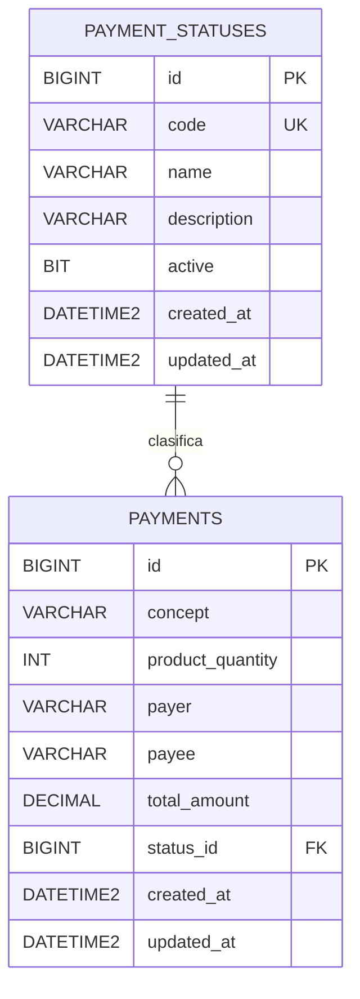

# Documentación de base de datos

Base de datos propuesta: **SQL Server**.

El diseño se hizo relacional porque el pago tiene un estatus que puede cambiar o crecer en el tiempo. Por eso el estatus no se guarda como texto directo en `payments`; se separa en una tabla catálogo llamada `payment_statuses`.

## Diagrama entidad-relación



## Relación

- Un registro de `payment_statuses` puede estar relacionado con muchos registros de `payments`.
- Un pago solo puede tener un estatus actual.
- La relación se resuelve con `payments.status_id -> payment_statuses.id`.

## Tabla `payment_statuses`

Catálogo de estatus posibles para un pago.

| Campo | Tipo | Llave | Descripción |
|---|---:|---|---|
| id | BIGINT IDENTITY | PK | Identificador del estatus |
| code | VARCHAR(30) | UK | Código técnico: `PENDING`, `PAID`, etc. |
| name | VARCHAR(80) |  | Nombre visible del estatus |
| description | VARCHAR(255) |  | Descripción del estatus |
| active | BIT |  | Permite activar/desactivar estatus sin borrarlos |
| created_at | DATETIME2 |  | Fecha de creación |
| updated_at | DATETIME2 |  | Fecha de última actualización |

## Tabla `payments`

Tabla principal de pagos.

| Campo | Tipo | Llave | Descripción |
|---|---:|---|---|
| id | BIGINT IDENTITY | PK | Identificador del pago |
| concept | VARCHAR(150) |  | Concepto del pago |
| product_quantity | INT |  | Cantidad de productos |
| payer | VARCHAR(120) |  | Persona que realiza el pago |
| payee | VARCHAR(120) |  | Persona o entidad que recibe el pago |
| total_amount | DECIMAL(18,2) |  | Monto total |
| status_id | BIGINT | FK | Estatus actual del pago |
| created_at | DATETIME2 |  | Fecha de creación |
| updated_at | DATETIME2 |  | Fecha de última actualización |

## Estatus iniciales

| Código | Nombre |
|---|---|
| PENDING | Pendiente |
| PROCESSING | Procesando |
| PAID | Pagado |
| REJECTED | Rechazado |
| CANCELLED | Cancelado |

## Justificación del diseño

Este diseño permite agregar nuevos estatus sin modificar la estructura de `payments`. Por ejemplo, si después se requiere `REFUNDED`, `FAILED`, `EXPIRED` o `IN_REVIEW`, solo se inserta un nuevo registro en `payment_statuses`.

También evita datos inconsistentes porque `payments.status_id` siempre apunta a un estatus válido.

## Script SQL

El script de creación de tablas está en:

```text
docs/database-ddl.sql
```
