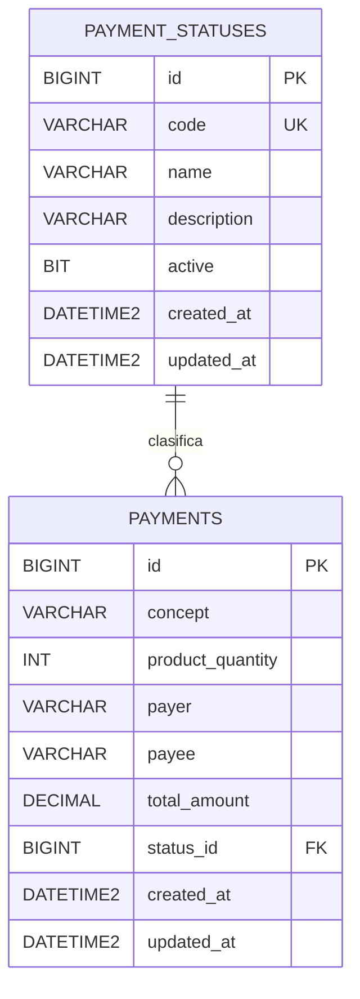

# Diagrama entidad-relación

Base de datos propuesta: **SQL Server**.

```mermaid
erDiagram
    PAYMENT_STATUSES ||--o{ PAYMENTS : "clasifica"

    PAYMENT_STATUSES {
        BIGINT id PK
        VARCHAR code UK
        VARCHAR name
        VARCHAR description
        BIT active
        DATETIME2 created_at
        DATETIME2 updated_at
    }

    PAYMENTS {
        BIGINT id PK
        VARCHAR concept
        INT product_quantity
        VARCHAR payer
        VARCHAR payee
        DECIMAL total_amount
        BIGINT status_id FK
        DATETIME2 created_at
        DATETIME2 updated_at
    }
```

Relación: `payment_statuses.id` 1:N `payments.status_id`.

La documentación completa está en `docs/database-design.md`.
